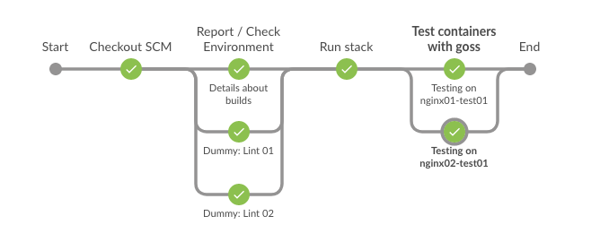

.. index::
    pair: kb; legacy
    pair: legacy, jenkinsfile
    pair: jenkinsfile; examples

Jenkinsfile
===========

.. contents::

Overview
--------

.. note::

    - This is a legacy content - and it may not be up-to-date.

Some time ago (long time ago) I was working with Jenkins - and I was using Jenkinsfile to define the pipeline.

Following examples are from that time - maybe they will be useful for someone (not sure if are still valid).

Example 01 - Run directly docker and docker-compose
---------------------------------------------------

.. tip::

    - This is really nice example how Jenkins can work with ``docker`` and ``docker-compose``.
    - This is a simple example to use ``goss`` to test the docker container.

**Code:**

.. literalinclude:: 001_Jenkinsfile
   :language: groovy

**And this is a result:**

Example 02 - Run docker via Jenkins plugin
------------------------------------------

Following example will run ansible from docker container - and will use credentails from Jenkins.

**Code:**

.. literalinclude:: 002_Jenkinsfile
   :language: groovy
