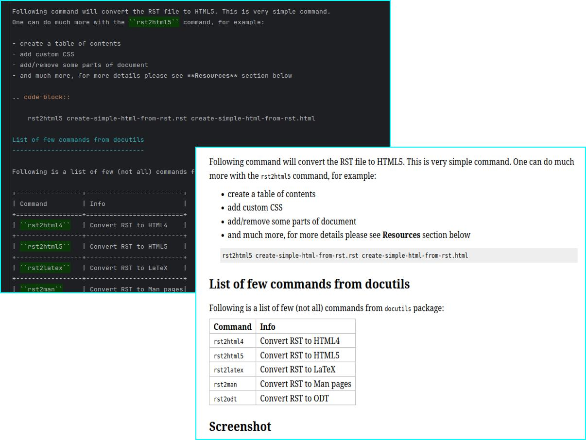

Create simple HTML from RST
===========================

.. post:: Nov 12, 2024
   :tags: RST, HTML, Converting
   :category: Development
   :author: Marcin Prączko
   :language: eg

Overview
--------

Sometimes one needs to create a simple HTML file, with nice formatting without spending too much time on it.
There is a simple way to do it, by converting RST file to HTML.

This post will show you how to create a simple HTML file

Requirements
------------

- ``Python``
- ``docutils`` package

Setup
-----

One should install the ``docutils`` package using ``pip``:

.. code-block:: bash

    pip install docutils

Examples
--------

Convert RST to HTML5
++++++++++++++++++++

Following example will convert this RST file to HTML5:

.. hint::

    This is a simple RST file, with some basic formatting.

Following command will convert the RST file to HTML5. This is very simple command.
One can do much more with the ``rst2html5`` command, for example:

- create a table of contents
- add custom CSS
- add/remove some parts of document
- and much more, for more details please see **Resources** section below

.. code-block::

    rst2html5 create-simple-html-from-rst.rst create-simple-html-from-rst.html

Example Output
++++++++++++++

Following screenshots shows two screenshots, one with RST file and second with HTML file:

Useful Commands
---------------

Following is a list of few (not all) commands from ``docutils`` package:

+-----------------+-------------------------+
| Command         | Info                    |
+=================+=========================+
| ``rst2html4``   | Convert RST to HTML4    |
+-----------------+-------------------------+
| ``rst2html5``   | Convert RST to HTML5    |
+-----------------+-------------------------+
| ``rst2latex``   | Convert RST to LaTeX    |
+-----------------+-------------------------+
| ``rst2man``     | Convert RST to Man pages|
+-----------------+-------------------------+
| ``rst2odt``     | Convert RST to ODT      |
+-----------------+-------------------------+

Conclusion
----------

This post showed how to create a simple HTML file from RST file. This is very simple and easy to do.
Also there are many more options available in the ``docutils`` package, for more details please see **Resources** section below.

.. _create-simple-html-from-rst-resources:

Resources
---------

- `RST to HTML5 documentation <https://rst2html5.readthedocs.io/en/latest/README.html>`_
