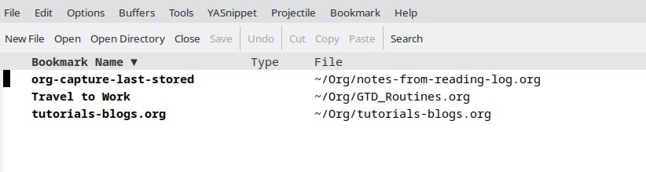

Emacs Bookmarks - Part 1
========================

.. post:: Jun 21, 2024
   :tags: emacs, bookmarks
   :category: Editors
   :author: Marcin Prączko
   :language: eg

Introduction
------------

During work with ``Emacs``, you may want to bookmark some files or positions in the file to quickly jump to them later.
This post will show you how to work with bookmarks in ``Emacs``.

This article is about vanilla ``Emacs`` and does not cover any specific packages that may provide additional functionality.

Quick shortcuts
---------------

It is worth to learn more about bookmarks in ``Emacs``, however you can start using them right away.

Following are some quick shortcuts to work with bookmarks in ``Emacs``:

- ``C-x r m`` - Set a bookmark at the current location
- ``C-x r l`` - List all bookmarks
- ``C-x r b`` - Jump to a bookmark
- ``M-x bookmark-delete`` - Delete a bookmark

Create a bookmark
-----------------

One of the most common operations is to create a bookmark at the current location.
This can be done by pressing ``C-x r m`` key sequence and adding a name for the bookmark.

Please try to use some names which quickly allow you to identify the bookmark later.

List all bookmarks
------------------

To list all bookmarks, you can use the ``C-x r l`` key sequence.

Above sequence will open a new buffer with a list of all bookmarks.

Following screenshot shows the list of bookmarks, where you can see the name of the bookmark and the file where it was created:

Jump to a bookmark
------------------

To jump to a bookmark, you can use the ``C-x r b`` key sequence.
After pressing the key sequence, you will be prompted to enter the name of the bookmark you want to jump to.

This is helpful when you known the name of the bookmark and want to quickly jump to it.
Also this is working with known prefix - you can type the first letters of the bookmark name and press ``TAB`` to complete the name.

Delete a bookmark
------------------

Looks like there is no built-in shortcut to delete a bookmark.
You can use the ``M-x bookmark-delete`` command to delete a bookmark.

After running the command, you will be prompted to enter the name of the bookmark you want to delete.

Summary
-------

This post showed you how to work with bookmarks in ``Emacs``.
Working with bookmarks can speed up your work and allow you to quickly jump between different locations in the files.

Resources
---------

Following resources can be helpful to learn more about bookmarks in ``Emacs``:

- `Bookmarks - Emacsdocs <https://emacsdocs.org/docs/emacs/Bookmarks>`_
- `Bookmarks - EmacsWiki <https://www.emacswiki.org/emacs/BookMarks>`_
- `Bookmarks - GNU Emacs Manual <https://www.gnu.org/software/emacs/manual/html_node/emacs/Bookmarks.html>`_

Following resources point to some alternative packages that can be used to manage bookmarks in ``Emacs``:

- `Bookmark+ - EmacsWiki <https://www.emacswiki.org/emacs/Bookmark%2b>`_
