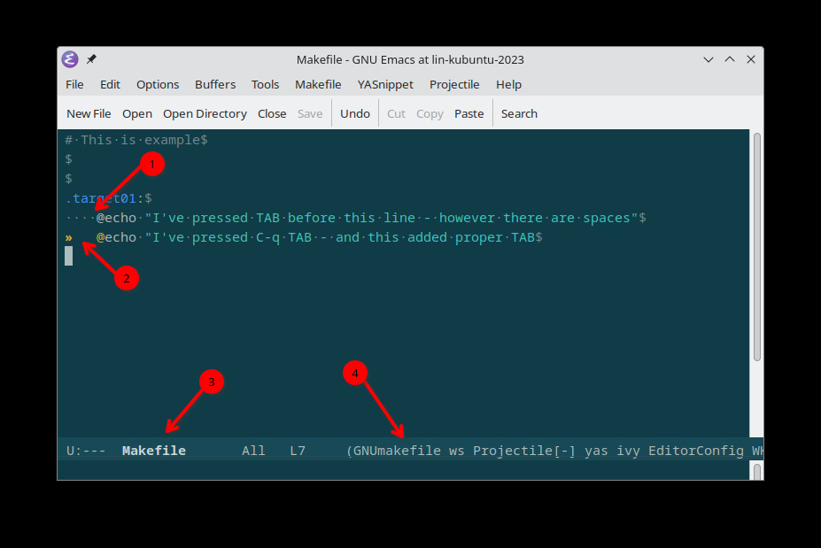

.. _emacs_makefile_tab_issue:

Emacs TAB Issue in Makefile
===========================

.. post:: Nov 08, 2024
   :tags: emacs, makefile, whitespace
   :category: Editors
   :author: Marcin Prączko
   :language: eg

Introduction
------------

During work with ``Emacs`` and ``Makefile``, you may encounter an issue with the ``TAB`` key.
This post will show you how to notice this issue and how to fix it.

Makefile is not running
-----------------------

When one is working with shell and runs ``make`` command, one can see following error:

.. code-block:: bash

    $ make
    Makefile:5: *** missing separator.  Stop.

Above error is caused by the issue with the ``TAB`` key in the Makefile.

Edit Makefile
-------------

``Emacs`` is good editor with built-in support for Makefiles.
However there is an issue with the ``TAB`` key in the Makefile.

Even when one opens Makefile and press ``TAB`` key, it is not always working as expected.
And this is not easy to notice.

Please see the following screenshot:

.. hint::
    To make this bigger please right click on screenshot and open in new tab

On the screenshot above, one can see:

1. There are four dots in the beginning of the line which are not visible in the editor (without special mode)
   And even when ``TAB`` was pressed from some reason ``Emacs`` converted it to spaces.
2. Line below one needed to force ``TAB`` key to be inserted by pressing ``C-q TAB`` key sequence (``C-q`` stands for ``CTRL-q``)
3. ``Emacs`` is aware that is working with Makefile
4. ``Emacs`` is having ``makefile-mode`` enabled

This is something which is not easy to notice and can cause issues with running Makefile.

Make whitespace visible
-----------------------

Above points allowed to notice the issue with the ``TAB`` key in the Makefile.
However ``Emacs`` needs to be configured to show whitespace characters which are not visible by default.

To enable this feature please run following command: ``M-x whitespace-mode``

Fix the issue
-------------

Once the whitespace characters are visible, one can run following commands to fix the issue:

1. Move cursor to the beginning of file ``M-<``
2. Select full buffer: ``M-SPC`` and ``M->``
3. Run command ``M-x tabify``

Summary
-------

This post showed how to notice and fix the issue with the ``TAB`` key in the Makefile when working with ``Emacs``.

Resources
---------

.. seealso::

    - :ref:`makefile_tricks_and_tips`
