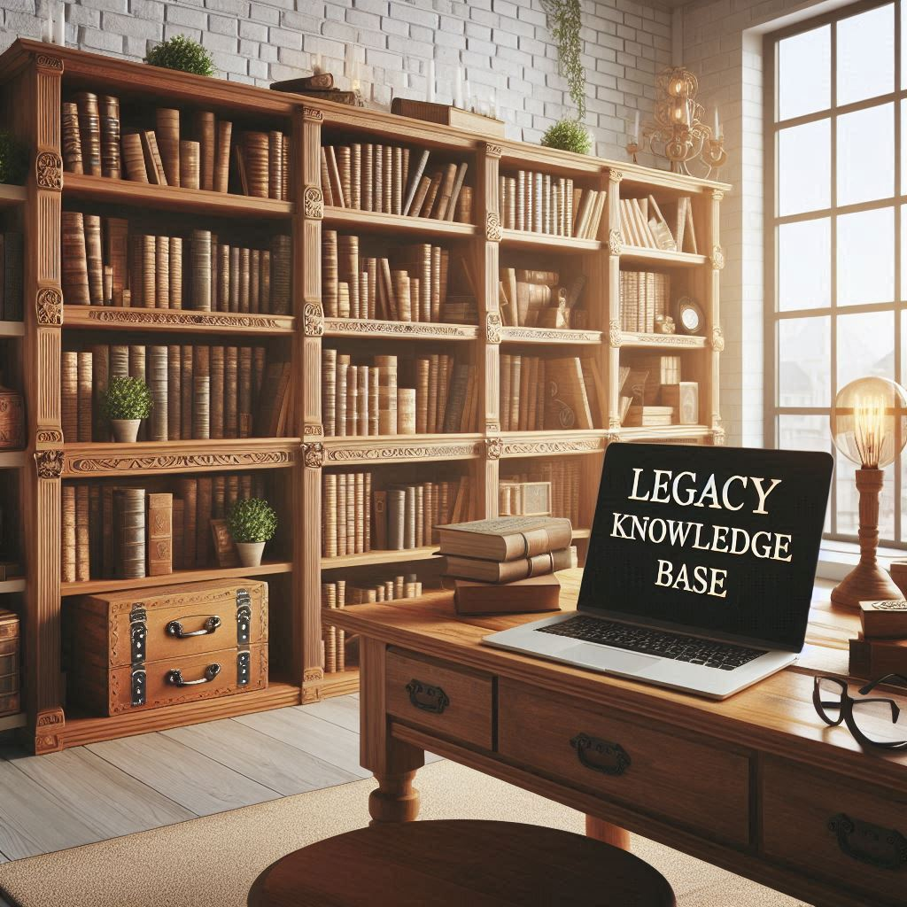

Legacy KB section
=================

.. TODO: Please move this date after `post` directive and update it accordingly.
..       Without moving this document is a draft.
..       https://ablog.readthedocs.io/en/stable/manual/forever-draft.html

.. post:: Aug 22, 2024
   :tags: new post, updateme
   :category: Development
   :author: Marcin Prączko
   :language: eg

Explore my legacy knowledge base section!
While some information may be outdated, it still contains valuable insights and solutions that can be useful for your projects. 
Dive in and discover the wealth of knowledge accumulated over the years.

.. note::

    I you are interested to see more, please visit :ref:`kb_legacy`

