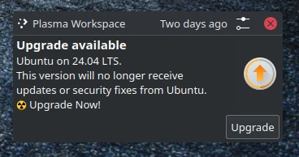

Upgrade Kubuntu 23.10 to 24.04
==============================

.. TODO: Please move this date after `post` directive and update it accordingly.
..       Without moving this document is a draft.
..       https://ablog.readthedocs.io/en/stable/manual/forever-draft.html
.. Jul 27, 2024
.. post::
   :tags: new post, updateme
   :category: Sysadmin
   :author: Marcin Prączko
   :language: eg

Introduction
------------

The moment has arrived to upgrade my laptop from ``Kubuntu 23.10`` to ``Kubuntu 24.04``.
When I received the notification about the new version, I decided it was time to take a big step.
However, the upgrade process was not without its challenges, especially given my laptop's unique configuration.
As is often the case, the standard procedures didn't quite work for me. In this post, I'll share my experiences and solutions,
hoping to make your upgrade journey smoother and more successful.

Some links which I've used during the upgrade process can be found in :ref:`upgrade-kubuntu-23.10-to-24.04-resources` section below:

I have really hope that this post will be valuable for you during the upgrade process of your ``Kubuntu`` system.

Short Summary
-------------

In this post, I will describe the steps I took to upgrade my laptop from ``Kubuntu 23.10`` to ``Kubuntu 24.04``.

You can expect the following:

- Preparation steps before the upgrade.
- How to move the snap folder to another partition *(related with the challenges of not having enough free space on the root partition)*
- Suprises during working from terminal (no wifi)
- Some issues after the upgrade.

Challenges before the upgrade
-----------------------------

Before starting the upgrade process, I had to face with some challenges:

- I knew that my root partition can have not enough free space.

I had root partition with ``20GB`` and only ``2GB`` free space. This was not enough for the upgrade process. 
Reason of so small root partition was that I have separate partition for major folders like ``/home``, ``/usr``.

Long time ago I've decided to have separate partitions for major folders based on my experience and recommendations from the internet.
However, it looks like those days are long gone, as I can see that having a ``20GB`` root partition today is not enough, which is really surprising to me.

I had to find a solution to free up some space.

Upgrade process - initial steps
-------------------------------

Fist I wanted to check major details about my operating system, so following is a part of the output from the ``neofetch`` command:

.. literalinclude:: _static/snippets/upgrade-kubuntu-23.10-to-24.04-neofetch01.txt
  :language: text

Second I confirmed that I want to do upgrade from terminal or console running under KDE Plasma.

.. important::

  Finally commands below has been run on console in KDE Plasma (which means on GUI and not in terminal).

Intitial commands
+++++++++++++++++

Following commands were used to start the upgrade process:

.. code-block:: bash

    # Update the package list and prepare for upgrade
    sudo apt-get update && sudo apt-get dist-upgrade

    # Install the update-manager-core package
    sudo apt install update-manager-core

Above commands worked without any issues.

Following command suprised me with many details related with the upgrade process and distribution

.. info::

    That was first time in my live when I've done upgrade process on ``Ubuntu/Kubuntu``.

.. code-block:: bash

    # Start the upgrade process
    sudo do-release-upgrade

And this displayed the following message:

.. literalinclude:: _static/snippets/upgrade-kubuntu-23.10-to-24.04-first-message.txt
  :language: text

.. info::

  I liked that on above message there were clear informations about:

  - Links to release notes, feedback and helping, contributing to Ubuntu, how to raise a bug and more.

Upgrade process - Issues
------------------------

And as expected ... first error appeared.

First error - not enough free space
+++++++++++++++++++++++++++++++++++

After confirming the upgrade process (by pressing ``Y``) I got the following error:

.. error::

  .. literalinclude:: _static/snippets/upgrade-kubuntu-23.10-to-24.04-error-not-enough-space.txt
    :language: text

Checking free space
+++++++++++++++++++

First step was to check what is taking up space on my root partition.
This can be done with the following command:

.. code-block:: bash

    # Show disk usage of the root partition
    ncdu -x /

This command will show you the disk usage of the root partition in nice and interactive way.

In command above:

- ``-x`` - is used to exclude other filesystems. This is important as I have separate partitions for major folders.

What was a suprise for me was that the ``/var/lib/snapd/`` folder was taking more than ``5GB (5.1GB)`` of space.

.. hint::

  - Snap is a software deployment and package management system for Linux. 
    It allows you to install and manage applications in a sandboxed environment called a snap.
  - Snap packages are self-contained and work across a range of Linux distributions.
    They are easy to install, secure, and up-to-date.
  - Snap packages are stored in the ``/var/lib/snapd/`` folder (Default location).

.. note::

  - I belive that ``snap`` is a great tool, however it is consuming so much space.
  - And not sure why this is not using ``/usr/local`` or ``/opt`` instead of root partition.

Incrasing free space - moving snap folder
+++++++++++++++++++++++++++++++++++++++++

Investigation showed that from my ``20GB`` root partition, the ``/var/lib/snapd/`` folder was taking more than ``5GB`` of space,
which is ``25%`` of the total space. This was a lot of space for me.

.. code-block:: text

  5,1G    /var/lib/snapd/

More suprising was that I am not using snap that much. I have only few applications installed via snap.

.. literalinclude:: _static/snippets/upgrade-kubuntu-23.10-to-24.04-snap-list.txt
  :language: text

Finding partition with free space
+++++++++++++++++++++++++++++++++

Lucky for me I got free space on another partition - however this required preparation and moving files to another partition.

.. code-block:: text

  Filesystem                          Size  Used Avail Use% Mounted on
  /dev/mapper/vg_data-lv_data         331G  270G   45G  86% /mnt/myworkspace

.. important::

  - I had to move the ``/var/lib/snapd/`` folder to another partition.
  - I had to be sure to do that properly, as snap is used by GUI applications (for example ``Firefox``).

Creating initial plan for moving snap folder
++++++++++++++++++++++++++++++++++++++++++++

Initially I was thinking that this needs to be done from terminal (no GUI), so that was a plan.

- Find documents how to move snap folder to another partition (including stopping services).
  Save this in text file - as working on terminal without GUI has some limitations (like using ``Links`` as a web browser).
- Install terminal web browser (like ``Links``) - to have option to search internet.
- Go to terminal run-level - without GUI
- Stop snap services and unmount snap folders
- Move snap folder to another partition
- Run upgrade process again
- Check if everything is working fine after upgrade
- After distro upgrade - reboot is recommended

Second error - no WIFI in terminal
++++++++++++++++++++++++++++++++++

After collecting enough documents and installing required software, I was ready to start the process.

1. I've switched to terminal (without GUI) - run-level 3.

.. code-block:: bash

  # Check current run-level
  $ who -r
  # >> run-level 5

  # Switch to run-level 3
  sudo systemctl isolate multi-user.target

  # ... 
  # When got console - I've login with my account
  who -r
  # >> run-level 3

2. Tried to check internet (good practice from my old days)

I wanted be sure that working with ``Links`` is possible, so I've tried to open some website by running ``links``, and ...

.. error::

  - Got message that ``links`` is not able to open website

- I've checked others commands ``curl``, ``wget``, ``dig`` and all of them were not working.
- Suprised - **no WIFI in terminal** !!

.. important::

  - That was really suprise for me - I was not able to use internet easily in terminal.
  - On my old days as sysadmin ``WIFI`` (networking) was runing on ``multi-user`` mode (run-level 3) and not on GUI.

.. tip::

  ``multi-user.target`` - This is a systemd target that sets up a non-graphical multi-user environment.
  It is similar to runlevel 3 in SysV init systems, where the system operates in a multi-user mode with 
  networking but without a graphical interface.

  - Above information comes from ``Chat GPT`` when asked about ``multi-user.target``.

That was too much errors for me - had no time to try setup ``WIFI`` on console. I've decided to reboot and move ``/var/lib/snapd/``
from GUI (With WIFI)

.. note::

  - Of course, I could return to the GUI without rebooting. However, I had done some extra steps in the terminal
    and was no longer happy to revert them in the terminal, so I decided to reboot. (I know — I gave up too early)

TODO
----

.. todo::

    - [ ] Related with task in ORG: ``112`` - ``Main Backlog``
    - Add details what I've done to fix the issue.
    - Try describe process as best as possible.

Snpa moving - GUI
+++++++++++++++++

.. note::

  - I have hope that one day I will write some tutorial about safe process of moving snap folder to another partition.
  - For this post I will describe only steps which I've done (And worked)

.. Place your content here and replace this text.

Steps (directy)
---------------

Stop snap
+++++++++

Migrate: snap:

sudo systemctl stop snapd
sudo systemctl stop snapd.socket

for mount in $(mount | grep /snap | awk '{print $3}'); do
    sudo umount $mount
done

sudo systemctl stop run-snapd-ns.mount (Looks like this helped stopped all mounted snaps)

Migration
+++++++++

- close firefox
- leave only console / tmux

# Add creation of folder
# OLD: mv -v /var/lib/snapd/* var-lib-snapd/
# Instead `mv -v` maybe one should use `rsync -aAX --info=progress2`
# CUR:
# rsync -aAX --info=progress2
# sync
# mv /var/lib/snapd/ /var/lib/snapd-old
# mkdir /var/lib/snapd/
# uncomment /etc/fstab
# Warning without command below
# systemctl daemon-reload
# mount /var/lib/snapd/ - Worked
# starting snapd - didn't work
# reboot
# everything seems be working fine

Update /etc/fstab - make sure that myworkspace is mount before snap

.. todo::

   Find commmands here - which I've run to check dependecies (tree / mount FS)

rm -Rf /var/lib/snapd-old (relased free space)

Everything seems be working now:

Screenshot
----------

Following screenshot shows the fuzzy search in action:

.. todo::

  - [ ] Add screenshot from neofetch  - Sort those images

- 23.10

.. image:: upgrade-kubuntu-neofetch-23-10.png
  :width: 512
  :alt: upgrade-kubuntu-neofetch-23-10.png

- 24.04

.. image:: upgrade-kubuntu-neofetch-24-04.png
  :width: 512
  :alt: upgrade-kubuntu-neofetch-24-04.png

.. todo::

  - Move this to another place - maybe to the top of the post

Issues
------

Looks like python venv stopped working

Python 3.12 become default
++++++++++++++++++++++++++

- Python 3.12 become default
- Looks like required to recreate venvs (at lest for this page)

Emacs
+++++

There is also issue with emacs - looks like I need to recompile it.
Looks like ``Emacs`` started dispalying warning messages.

- Emacs started consuming a lot of CPU

`M-x List-Packages` - Press `U` anx `x` - to update all packages

First time run - triggers some compilation of packages.

Compiling /usr/share/emacs/29.3/lisp/mail/mailheader.el.gz...
uncompressing mailheader.el.gz...
uncompressing mailheader.el.gz...done
Compiling /usr/share/emacs/29.3/lisp/gnus/gmm-utils.el.gz...
uncompressing gmm-utils.el.gz...
uncompressing gmm-utils.el.gz...done
Compiling /usr/share/emacs/29.3/lisp/mail/mailabbrev.el.gz...
uncompressing mailabbrev.el.gz...
uncompressing mailabbrev.el.gz...done
Compiling /usr/share/emacs/29.3/lisp/mail/ietf-drums.el.gz...
uncompressing ietf-drums.el.gz...
uncompressing ietf-drums.el.gz...done
Compiling /usr/share/emacs/29.3/lisp/mail/rfc2045.el.gz...
uncompressing rfc2045.el.gz...
uncompressing rfc2045.el.gz...done

In `Async-native-complie-log` - what is this?

- Nice https://www.emacswiki.org/emacs/InstallingPackages
- `list-packages` - `/s` Installed - Shows installed packages

.. _upgrade-kubuntu-23.10-to-24.04-resources:

Resources
---------

Ubuntu / Kubuntu
++++++++++++++++

- `Ubuntu.com - Kubuntu Release Notes <https://wiki.ubuntu.com/NobleNumbat/ReleaseNotes/Kubuntu>`_
- `Ubuntu.com - Kubuntu Upgrade Instructions <https://help.ubuntu.com/community/NobleUpgrades/Kubuntu>`_ - Here are instructions (I followed this)
- `Askubuntu.com - Upgrade via Command Line <https://askubuntu.com/questions/442290/how-can-i-upgrade-major-kubuntu-versions-by-command-line>`_
- `Linuxconfig.org - Step-by-Step Howto Guide <https://linuxconfig.org/ubuntu-upgrade-to-24-04-noble-numbat-a-step-by-step-howto-guide>`_

Others
++++++

- `Snap - docs <https://snapcraft.io/docs>`_
- `Askubuntu.com - How to deal with snap using a lot of storage space <https://askubuntu.com/questions/1335229/how-to-deal-with-snap-using-a-lot-of-storage-space>`_
  *(Comments on this says - that 20GB is not enough when SNAP is used)*
