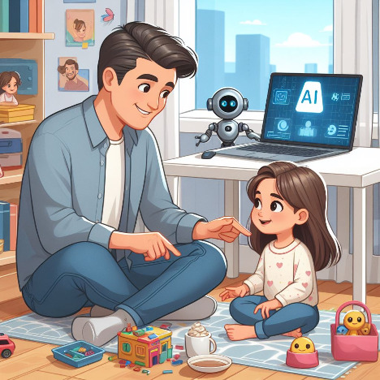

Using GenAI and have more time for family
=========================================

.. TODO: Please move this date after `post` directive and update it accordingly.
..       Without moving this document is a draft.
..       https://ablog.readthedocs.io/en/stable/manual/forever-draft.html

.. MPOSL-ID: mposl-00098

.. post:: Nov 20, 2025
   :tags: AI, life, family, productivity
   :category: Personal
   :author: Marcin Prączko
   :language: eg

Observation
------------

It has been a while since I started using Generative AI tools in my daily and professional life.
In theory, they should help us get time back for more important things, like spending time with family.

Looking back, this hasn’t been true for me. Indeed, I can do things faster, but I also tend to take
on more tasks and try too many proofs of concept with GenAI tools. This is taking more time than I expected.

The same is true in my professional life: I can do things faster, but I also tend to take on more tasks because
there are endless ideas to create new things with GenAI tools, apps and integrations.

The goal is always the same — we want to go faster and be more efficient, but we don't really realize that speed
is something that causes us to lose focus on what is really important.

Let's break this down into a few points:

- Using GenAI tools is great, but in many cases we do not understand what has been created — as long as it is working,
  we are happy. But when things break, we realize how much time is required to fix them and to understand what went wrong.
- Speed allows us setup quickly some prototypes, but we tend to create more and more prototypes, and we
  never really finish them. This is causing a lot of unfinished work that requires time to maintain.
- When we are working with GenAI it is really hard to stop as we have this constant dopamine rush when something
  is created quickly.
- Fear of missing out (FOMO) is another important factor that is causing us to take on more and more tasks.
  I have constant feeling that I need to stay up to date with the latest GenAI tools and trends, and this is causing
  me to spend more time exploring new tools instead of having more time for things that are really important.

- Businesses expecting to deliver more in less time, but not really understanding that quality is something what
  requires time and focus.
- There is even trend to pushing more work flow named `996`_ - working from 9am to 9pm, 6 days a week. This is not healthy
  and not something what should be accepted.
- Working with constant speed is causing burnout as we do not have time to rest and recover especially that number if
  delivered increases significantly and we are no longer able to memorize and understand everything what has been done.

And the most important from all of this observation is that we are not training our brain to memorize and understand things deeply.

I remember a lot from my past learning and experience - of course that was slower but even today I can be woken up at night
and remember some details from years ago. When I started using GenAI tools I realized that I am not able
to remember things as I just rely on GenAI tools to provide me with information when I need it.
I struggle to memorize even simple algorithms or code snippets and this is really worrying as I feel that my brain is getting lazy.

Conclusion
----------

Some time ago I wrote a post on LinkedIn `mplinkedin_post_about_genai`_ where I asked myself and others a question

.. epigraph::

   A 'Battle' began … I still hope we learned from the past about technology — speed isn't the only factor in life (or success).

   — Marcin Prączko

And after long deep thinking I realized that we are losing this battle as we are not focusing what is important,
only what is fast.

I wish all of us, including myself, to slow down a bit and get time back for more important things in life, like spending time with family,
enjoying times without computers and without constant worries about FOMO (Fear Of Missing Out).

In terms of commercial success I wish for all of us to focus on quality and deep understanding of what we are doing, instead of
just doing this fast - generate a lot of code which can't be easily understood.

Real speed only comes with quality and proper goal setup - it is really hard ``go fast`` if we do not know where we are going
and why generated solutions are not working as expected.

References
----------
.. _996: https://en.wikipedia.org/wiki/996_working_hour_system
- `996`_ - Working hour system (Wikipedia)

.. _mplinkedin_post_about_genai: https://www.linkedin.com/posts/marcinpraczko_i-have-to-say-that-i-am-really-surprised-activity-7148950612813021184-91l6
- `mplinkedin_post_about_genai`_ - Marcin's LinkedIn post about GenAI - when all of this started.
