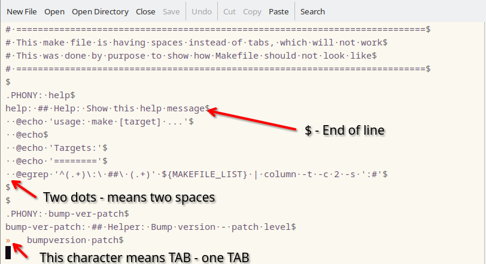
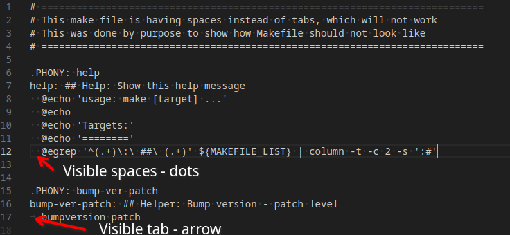

Working with code
=================

.. contents:: Table of Contents
   :local:
   :depth: 2

Code formatting
---------------

Writting Makefiles requires to follow specific rules. Below are some of the rules that should be followed when writing Makefiles:

- Use tabs for indentation instead of spaces (this is a requirement for Makefiles)
- The first target in the Makefile is the default target
- On targets tabse should be used for indentation (only one tab)

Copy / Paste code snippets
--------------------------

Many times one will copy/paste code snippets from the web. This can lead to issues with the formatting of the code.
To avoid this, one should make sure that the code is properly formatted after pasting it.
Otherwise, the Makefile will not work as expected, please see the example below of wrongly formatted Makefile:

Example of wrong formatted Makefile
-----------------------------------

Following snippet shows example of wrongly formatted ``Makefile``, this is not visible at first glance,
however after ``COPY`` this snippet from this website and ``PASTE`` inside editor, when one will try to run it, it will fail.

.. literalinclude:: Makefile_wrong_formatting
   :language: make

When one will try run this Makefile, it will fail with the following error:

.. code-block:: bash

    $ make -f Makefile_wrong_formatting
    Makefile_wrong_formatting:9: *** missing separator.  Stop.

Displaying whitespace characters
--------------------------------

.. hint::

    - There are invisible characters in files with code, and they are called ``whitespace``.
    - One should find solution how to display them in editor, so one can see them and remove them if needed.

Depends of the editor, there are different ways to display whitespace characters.
Below are some examples how to display them in some editors and command line.

.. important::

    - Please always make sure that files are correctly formatted.

.. _displaying-whitespace-characters-command-line:

Displaying whitespace characters in command line
++++++++++++++++++++++++++++++++++++++++++++++++

Following command allows display whitespace characters in the file:

.. tabs::

    .. tab:: Linux

        .. code-block:: bash

            cat -T Makefile_wrong_formatting

        Following result shows TAB characters in the file:

        .. image:: img-01.png

        - ``#1`` - shows SPACE characters - not visible
        - ``#2`` (``^I``) - shows TAB character - visible

Displaying whitespace characters in Emacs
+++++++++++++++++++++++++++++++++++++++++

Following screenshot shows how to display whitespace characters in ``Emacs``.
This can be done by running ``M-x whitespace-mode`` command.

.. seealso::

    - :ref:`emacs_makefile_tab_issue`

Displaying whitespace characters in Vscode
++++++++++++++++++++++++++++++++++++++++++

Following screenshot shows how to display whitespace characters in ``vscode``.
This can be achieved by pressing ``Ctrl + Shift + P``, typing ``Render Whitespace``,
and selecting the ``View: Toggle Render Whitespace`` option.

Fixing wrongly formatted Makefile
---------------------------------

There are several ways to fix wrongly formatted Makefile, following are some of the ways:

From command line
+++++++++++++++++

As we lerned in section above how to display whitespace characters in command line, one can use this to fix wrongly formatted Makefile.

.. seealso::

    - :ref:`displaying-whitespace-characters-command-line`

One should run following command to replace leading spaces with tabs:

.. tabs::

    .. tab:: Linux

        .. code-block:: bash

            sed 's/ \+ /\t/g' Makefile_wrong_formatting | cat -T

        - ``sed`` is a tool for parsing and transforming text and works with ``regular expressions``

        Following result shows TAB characters in the file:

        .. image:: img-03.png

        - ``#1`` - SPACES has been replaced with TAB characters (visible ``^I``)
        - ``#2`` - TAB characters are visible (not changed)

Once the file has been revired that it is correctly formatted, one can save it to new file and run it:

.. tabs::

    .. tab:: Linux

        .. code-block:: bash

            # Replace spaces with tabs and save it to new file
            sed 's/ \+ /\t/g' Makefile_wrong_formatting > Makefile_wrong_formatting_fixed
            make -f Makefile_wrong_formatting_fixed

        In code above, we are replacing spaces with tabs and saving it to new file ``Makefile_wrong_formatting_fixed``.

        .. note::

            Please note that we skipped ``cat -T`` command, as we are not interested to display whitespace characters in final file.

Summary
-------

One needs to remember that Makefiles require specific formatting, and one should always make sure that the Makefile is correctly formatted.
There are different ways to display whitespace characters in the editor, and one should use this to make sure that the file is correctly formatted.
