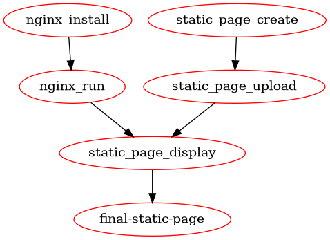

Create nice dependency graph
============================

.. contents:: Table of Contents
   :local:
   :depth: 2

Visualizing Makefile Dependencies
---------------------------------

In previous examples (:ref:`create_nice_dependency_of_tasks` and :ref:`create_nice_dependency_of_tasks_one_liners`)
we have shown how to create nice dependency of tasks in ``Makefile``.

This example will show how to create dependency graph from Makefile, which can be used to visualize dependencies between tasks.

Example scenario
----------------

Expected scenario is following:

- Install and run webserver (``nginx``).
- Create single page with some content.
- Upload page to webserver.

Showing order of tasks
----------------------

As before we will use ``Makefile`` to show order of tasks which are required to finish task.

Code
++++

Following code shows steps which are required to setup webserver, create page and upload it.

.. literalinclude:: Makefile
   :language: make
   :start-after: # == Steps start - marker for doc ==
   :end-before: # == Steps stop - marker for doc ==

Result
++++++

Following result shows steps to work on in order to finish task.

.. literalinclude:: Makefile_result.txt
   :language: console

As we can see in result above, we have clear order of tasks which are required to finish task.

Create nice dependency graph
----------------------------

However in more complex scenarios it can be hard to visualize dependencies between tasks in plain text.
Some task can be run in parallel (for example by different teams), some tasks can be run only after other tasks are finished.

Would be nice to have graph which shows dependencies between tasks.

Graphviz and make2graph
-----------------------

Lucky for us there is software ``make2graph`` which allows to create graph from Makefile in very easy way.
Tool ``make2graph`` is using ``Graphviz`` to create graph from Makefile (by using DOT language).

Please check following links for more information:

- `Repository - makefile2graph <https://github.com/lindenb/makefile2graph>`_
- `Graphviz - HomePage <https://graphviz.org/>`_
- `Graphviz - Wikipedia <https://en.wikipedia.org/wiki/Graphviz>`_
- `DOT (graph description language) - Wikipedia <https://en.wikipedia.org/wiki/DOT_(graph_description_language)>`_

Installation
++++++++++++

Also one can install ``make2graph`` and ``graphviz`` by using following command:

.. tabs::

   .. tab:: Ubuntu

      .. code-block:: bash

         sudo apt-get install makefile2graph graphviz

Create graph
++++++++++++

Once all tools are installed, one can create graph by using following command.

.. hint::

   - Following example shows target from Makefile which is used to create graph, however one can use this command in terminal.
   - Please look for command below which starts with ``@make`` - and when copy it to terminal, remove ``@`` character.

.. literalinclude:: Makefile
   :language: make
   :start-after: # == Build graph start - marker for doc ==
   :end-before: # == Build graph stop - marker for doc ==

And after runnig above command we can see nice graph which shows dependencies between tasks.

This graph shows that:

- Install and Run webserver can be done by one team.
- Create page can be done by another team.
- Both teams can work in parallel.
- Above graphs shows general tasks - however there some decision needs to be taken, for example how to upload page to webserver.

Final Makefile
--------------

All above steps can be done by using following Makefile, which will have targets:

- Steps required to finish task.
- Target to create graph.
- Help target to show available targets.

.. literalinclude:: Makefile
   :language: make

Summary
-------

In this example we have shown how to create dependency graph from ``Makefile``.
By using ``make2graph`` and ``Graphviz`` we can visualize dependencies between tasks in very easy way.
This can help to understand dependencies between tasks and to plan work not only in more efficient way,
but also in more parallel way.

Also having graph allows quicker see which tasks depends of each other and which tasks,
this is not always easy to see in plain text.
