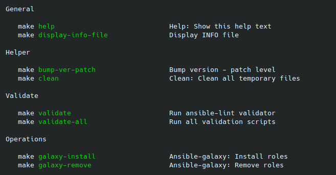

Self documented Makefile - Advanced example
===========================================

Following example shows more advanced self documented ``Makefile``.

- This solution allows group tasks together based on special comment before targets

Code
----

.. literalinclude:: Makefile
   :language: make

Result
------

Running ``make`` without any arguments will display list of available tasks.

Im result above one can see targets in separated groups.
